## dod

### ports

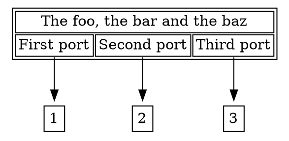

### Project Dependencies

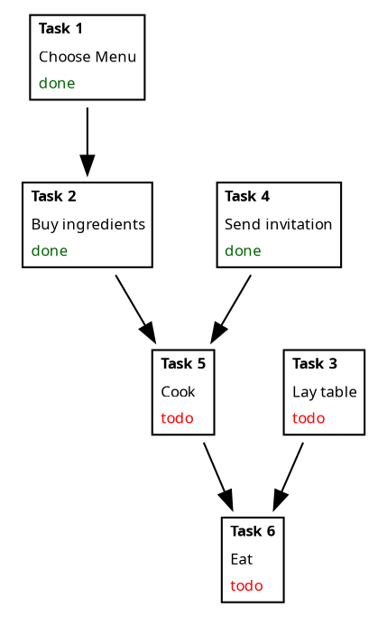
### organization chart

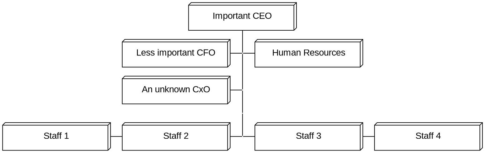

### Basic Git Concepts and Operations

```dot
digraph git_basics {
	graph [
		label = "Basic git concepts and operations\n\n"
		labelloc = t
		fontname = "Helvetica,Arial,sans-serif"
		fontsize = 20
		layout = dot
		rankdir = LR
		newrank = true
	]
	node [
		style=filled
		shape=rect
		pencolor="#00000044" // frames color
		fontname="Helvetica,Arial,sans-serif"
		shape=plaintext
	]
	edge [
		arrowsize=0.5
		fontname="Helvetica,Arial,sans-serif"
		labeldistance=3
		labelfontcolor="#00000080"
		penwidth=2
		style=dotted // dotted style symbolizes data transfer
	]
	changes [
		color="#88000022"
		label=<<table border="0" cellborder="1" cellspacing="0" cellpadding="4">
			<tr> <td> <b>changes</b><br/>in the working tree </td> </tr>
			<tr> <td align="left"><i>To view: </i><br align="left"/>
			git diff
			<br align="left"/></td> </tr>
		</table>>
		shape=plain
	]
	staging [
		fillcolor="#ff880022"
		label=<<table border="0" cellborder="1" cellspacing="0" cellpadding="4">
			<tr> <td> <b>staging area</b><br/>(cache, index)</td> </tr>
			<tr> <td align="left"><i>To view: </i><br align="left"/>
			git diff --staged
			<br align="left"/></td> </tr>
		</table>>
		shape=plain
	]
	staging -> HEAD:push [label="git commit" weight=1000 color="#88000088"]
	stash [
		fillcolor="#0044ff22"
		label=<<table border="0" cellborder="1" cellspacing="0" cellpadding="4">
			<tr> <td> <b>stash</b></td> </tr>
			<tr> <td align="left"><i>To view:</i><br align="left"/>
			git stash list
			<br align="left"/></td> </tr>
		</table>>
		shape=plain
	]
	stash_push [
		label="git stash [push]"
		style=""
		shape=plain
		color="#00008844"
	]
	{
		edge [arrowhead=none color="#00008844"]
		changes ->  stash_push
		stash_push -> staging
	}
	changes -> stash [
		dir=back
		xlabel="git stash pop"
		color="#00000088" weight=0]
	stash_push -> stash [xdir=back color="#00008844" minlen=0]
	HEAD [
		fillcolor="#88ff0022"
		label=<<table border="0" cellborder="1" cellspacing="0" cellpadding="3">
			<tr> <td port="push" sides="ltr"> <b>HEAD </b>of</td> </tr>
			<tr> <td port="pull" sides="lbr"> the current branch</td> </tr>
			<tr> <td port="switch" align="left">
				<i>To view:</i>
				<br align="left"/>
				git show<br align="left"/>
				git log
				<br align="left"/>
			</td> </tr>
			<tr> <td align="left">
				<i>To change branch:</i><br align="left"/>
				git switch ...
				<br align="left"/>
				git checkout ...
				<br align="left"/>
			</td> </tr>
		</table>>
		shape=plain
	]
	remote [
		label="remote branch"
		shape=box
		color="#00000022"
		fillcolor="#00ff0022"
	]

	HEAD:push -> remote [label="git push" color="#88000088"]
	HEAD:pull -> remote [dir=back label="git pull" color="#00440088"]
	branches [
		fillcolor="#00888822"
		label=<<table border="0" cellborder="1" cellspacing="0" cellpadding="4">
			<tr> <td> <b>local branches</b> </td> </tr>
			<tr> <td align="left"><i>To view:</i><br align="left"/>
			git branch [--list]
			<br align="left"/></td> </tr>
			</table>>
		shape=plain
	]
	changes -> staging [label="git add ...    \ngit reset      " color="#88000088"]
	discard [shape=plaintext style=""]
	changes -> discard [label="git restore ..." color="#88000088"]
	{rank=same changes discard}
	// UML style aggregation
	HEAD:switch -> branches [
		dir=back
		style=""
		penwidth=1
		arrowtail=odiamond
		arrowhead=none
		color="#00000088"
	]
}
// © 2022 Costa Shulyupin, licensed under EPL
```

### data structures

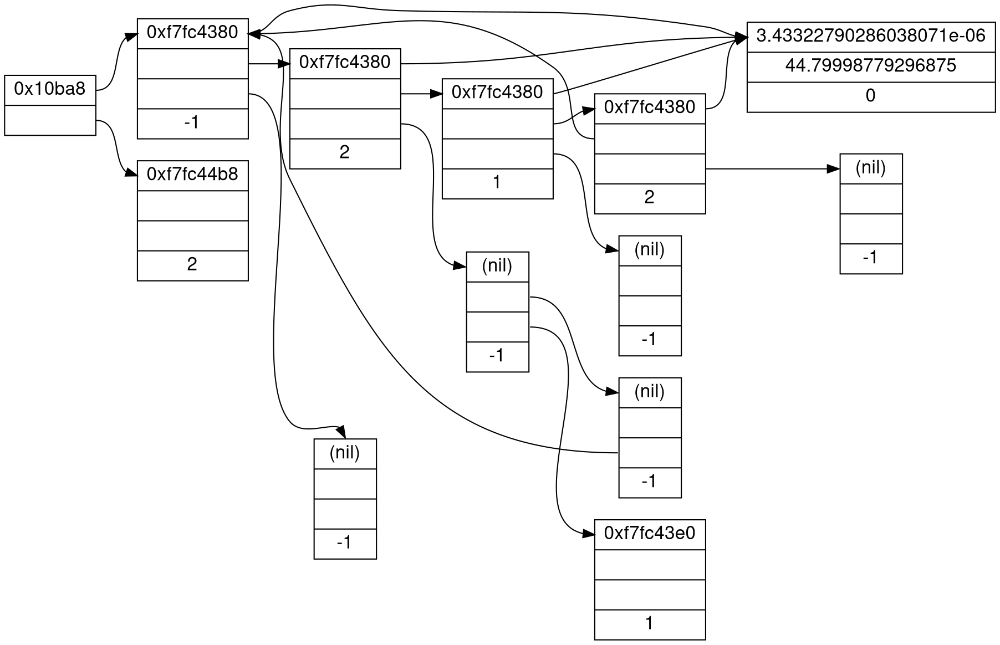

### Linux kernel diag

```dot
digraph "Linux_kernel_diagram" {
	fontname="Helvetica,Arial,sans-serif"
	node [fontname="Helvetica,Arial,sans-serif"]
	edge [fontname="Helvetica,Arial,sans-serif"]
	graph [
		newrank = true,
		nodesep = 0.3,
		ranksep = 0.2,
		overlap = true,
		splines = false,
	]
	node [
		fixedsize = false,
		fontsize = 24,
		height = 1,
		shape = box,
		style = "filled,setlinewidth(5)",
		width = 2.2
	]
	edge [
		arrowhead = none,
		arrowsize = 0.5,
		labelfontname = "Ubuntu",
		weight = 10,
		style = "filled,setlinewidth(5)"
	]
	subgraph system {
		node [color = "#e27dd6ff"]
		edge [color = "#e27dd6ff"]
		system_ [
			fixedsize = true,
			height = 0,
			shape = point,
			style = invis,
			shape = point
		]
		system [
			URL = "https://en.wikibooks.org/wiki/The_Linux_Kernel/System",
			fillcolor = white,
			fixedsize = true,
			height = 0.6,
			row = func,
			width = 2]
		system -> system_ [
			arrowhead = "",
			row = func];
		SCI [
			URL = "https://en.wikibooks.org/wiki/The_Linux_Kernel/Syscalls",
			fillcolor = "#d9e7ee",
			fixedsize = true,
			label = "System calls",
			row = usr,
			shape = ellipse]
		sysfs [
			fillcolor = "#b2d3e4",
			label = "proc & sysfs\nfile systems"]
		SCI -> sysfs
		DM [
			fillcolor = "#91b5c9",
			fixedsize = true,
			fontsize = 20,
			height = 0.8,
			label = "Device\nModel",
			shape = octagon,
			width = 2]
		sysfs -> DM
		log_sys [
			fillcolor = "#6a9ab1",
			fontsize = 20,
			label = "system run,\nmodules,\ngeneric\nHW access "]
		DM -> log_sys
		bus_drv [
			fillcolor = "#71809b",
			label = "bus drivers"]
		log_sys -> bus_drv
		buses [
			fillcolor = "#777777",
			fontcolor = white,
			fontsize = 20,
			label = "buses:\nPCI, USB ...",
			row = chip]
		bus_drv -> buses
	}
	subgraph networking {
		node [color = "#61c2c5"]
		edge [color = "#61c2c5"]
		networking_ [
			fixedsize = true,
			height = 0,
			shape = point,
			style = invis,
			shape = point
				width = 0]
		networking [
			URL = "https://en.wikibooks.org/wiki/The_Linux_Kernel/Networking",
			fillcolor = white,
			fixedsize = true,
			height = 0.6,
			row = func,
			width = 2]
		networking -> networking_ [
			arrowhead = "",
			row = func]
		sock [
			fillcolor = "#d9e7ee",
			fixedsize = true,
			label = Sockets,
			row = usr,
			shape = ellipse]
		prot_fam [
			fillcolor = "#b2d3e4",
			label = "protocol\nfamilies"]
		sock -> prot_fam
		log_prot [
			fillcolor = "#6a9ab1",
			label = "protocols:\nTCP, UDP, IP"]
		prot_fam -> log_prot
		netif [
			fillcolor = "#71809b",
			fontsize = 20,
			label = "network\ninterfaces\nand drivers"]
		log_prot -> netif
		net_hw [
			fillcolor = "#777777",
			fontcolor = white,
			fontsize = 20,
			label = "network:\nEthernet, WiFi ...",
			row = chip]
		netif -> net_hw
		NFS [
			color = "#8383cc",
			fillcolor = "#91b5c9",
			fixedsize = true,
			height = 0.8,
			label = NFS,
			shape = octagon,
			width = 1.2]
		NFS -> log_prot [weight = 0]
	}
	subgraph processing {
		node [color = "#c46747"]
		edge [color = "#c46747"]
		processing_ [
			fixedsize = true,
			height = 0,
			shape = point
				style = invis,
			width = 0]
		processing [
			URL = "https://en.wikibooks.org/wiki/The_Linux_Kernel/Processing",
			fillcolor = white,
			fixedsize = true,
			height = 0.6,
			row = func,
			width = 2]
		processing -> processing_ [
			arrowhead = "",
			row = func]
		proc [
			fillcolor = "#d9e7ee",
			fixedsize = true,
			label = Processes,
			row = usr,
			shape = ellipse]
		Tasks [
			fillcolor = "#b2d3e4"]
		proc -> Tasks
		sync [
			fillcolor = "#91b5c9",
			fixedsize = true,
			fontsize = 20,
			fontname = "Arial Narrow"
			label = synchronization,
			height = 0.7,
			//width = 2,
			shape = octagon]
		Tasks -> sync
		sched [
			fillcolor = "#6a9ab1",
			label = Scheduler]
		sync -> sched
		IRQ [
			fillcolor = "#71809b",
			fontsize = 20,
			label = "interrupts\ncore,\nCPU arch"]
		sched -> IRQ
		CPU [
			fillcolor = "#777777",
			fontcolor = white,
			fontsize = 20,
			row = chip]
		IRQ -> CPU
	}	// processing
	subgraph mem {
		node [
			color = "#51bf5b",
			height = 1
		]
		edge [color = "#51bf5b"]
		MA [
			color = "#51bf5b",
			fillcolor = "#d9e7ee",
			fixedsize = true,
			label = "memory\naccess",
			row = usr,
			height = 1,
			shape = ellipse]
		MA -> VM
		mmap [
			fillcolor = "#91b5c9",
			fixedsize = true,
			fontsize = 20,
			height = 0.8,
			label = "memory\nmapping",
			shape = octagon,
			width = 2]
		mmap -> log_mem
		log_mem -> PA
		SW [
			color = "#8383cc",
			fillcolor = "#91b5c9",
			fixedsize = true,
			label = Swap,
			height = 0.8,
			shape = octagon,
			width = 1.2]
		mmap -> SW [weight = 1]
		SW -> block [
			color = "#8383cc", weight = 1]
		PA [
			fillcolor = "#71809b",
			label = "Page\nAllocator"
		]
		PC -> PA [weight = 0 color="#51bf5b"]
		RAM [
			color = "#51bf5b",
			fillcolor = "#777777",
			fontcolor = white,
			fontsize = 20,
			label = "MMU, RAM",
			height = 1,
			row = chip]
		PA -> RAM
		memory -> memory_ [
			arrowhead = "",
			row = func]
		VM -> mmap
	}	// mem
	subgraph storage {
		node [color = "#8383cc"]
		edge [color = "#8383cc"]
		NFS;
		storage_ [
			shape = point,
			fixedsize = true,
			height = 0,
			style = invis,
			width = 0]
		storage [
			URL = "https://en.wikibooks.org/wiki/The_Linux_Kernel/Storage",
			fillcolor = white,
			fixedsize = true,
			height = 0.6,
			row = func,
			width = 2]
		storage -> storage_ [
			arrowhead = "",
			row = func]
		FS [
			fillcolor = "#d9e7ee",
			fixedsize = true,
			label = "files and\ndirectories",
			row = usr,
			shape = ellipse]
		VFS [
			fillcolor = "#b2d3e4",
			label = "Virtual\nFile System"]
		FS -> VFS
		VFS -> mmap [weight = 0]
		VFS -> NFS [weight = 0]
		logFS [
			fillcolor = "#6a9ab1",
			fontsize = 20,
			label = "logical\nfilesystems:\next3, xfs ..."]
		VFS -> logFS
		PC [
			fillcolor = "#91b5c9",
			fixedsize = true,
			fontsize = 20,
			height = 0.8,
			label = "page\ncache",
			shape = octagon,
			width = 1.2]
		VFS -> PC [weight = 0]
		block [
			fillcolor = "#71809b",
			fontsize = 20,
			label = "Block\ndevices\nand drivers"]
		logFS -> block
		SD [
			fillcolor = "#777777",
			fontcolor = white,
			fontsize = 20,
			label = "storage devices:\nSCSI, NVMe ...",
			row = chip]
		block -> SD
	}	// storge
	subgraph HI {
		node [color = "#cfbf57ff"]
		edge [
			color = "#cfbf57ff",
			weight = 10
		]
		HI_ [
			fixedsize = true,
			height = 0,
			shape = point,
			style = invis,
			width = 0]
		HI [
			URL = "https://en.wikibooks.org/wiki/The_Linux_Kernel/Human_interfaces",
			fillcolor = white,
			fixedsize = true,
			fontsize = 12,
			height = 0.6,
			label = "human\ninterface",
			row = func,
			width = 2]
		HI -> HI_ [
			arrowhead = "",
			row = func]
		char [
			fillcolor = "#d9e7ee",
			fixedsize = true,
			label = "char\ndevices",
			row = usr,
			shape = ellipse]
		input [
			fillcolor = "#b2d3e4",
			label = "input\nsubsystem"]
		char -> input
		F7 [
			fillcolor = "#6a9ab1",
			label = "HI class\ndrivers"]
		input -> F7
		HID [
			fillcolor = "#71809b",
			fontsize = 20,
			URL = "https://www.kernel.org/doc/html/latest/hid/",
			label = "HI\nperipherals\ndrivers"]
		F7 -> HID
		display [
			fillcolor = "#777777",
			fontcolor = white,
			fontsize = 19,
			label = "keyboard, mouse,\ndisplay, audio",
			row = chip]
		HID -> display
	} // HI
	subgraph functions {
		graph [rank = same]
		edge [
			style = invis,
			weight = 1
		]
		system;
		networking;
		system -> processing [weight = 1]
		storage -> networking [weight = 1]
		memory [
			color = "#51bf5b",
			URL = "https://en.wikibooks.org/wiki/The_Linux_Kernel/Memory",
			fillcolor = white,
			fixedsize = true,
			height = 0.6,
			row = func,
			width = 2]
		memory -> storage [weight = 1]
		processing -> memory [weight = 1]
		functions_ [
			fixedsize = true,
			height = 0,
			shape = point
			style = invis,
			width = 0]
		functions_ -> HI -> system [weight = 1]
		functions [
			color = gray,
			tooltip = "Columns represent main functionalities of the kernel",
			URL = "http://www.makelinux.net/ldd3/chp-1-sect-2.shtml",
			fillcolor = gray,
			fixedsize = true,
			height = 0.6,
			row = func,
			style = dashed,
			width = 1.6]
		functions -> functions_ [
			arrowhead = "",
			color = gray,
			style = "",
			weight = ""]
	}
	subgraph interfaces {
		graph [rank = same]
		SCI;
		sock;
		FS;
		proc;
		char;
		usr_ [
			fixedsize = true,
			height = 0,
			shape = point
				style = invis,
			width = 0.5]
		usr [
			fillcolor = "#d9e7eeff",
			fixedsize = true,
			label = "user space\ninterfaces",
			row = usr,
			shape = ellipse,
			style = "filled,setlinewidth(0)"]
		MA;
	}
	{
		edge [style = invis weight = 10 ]
		system_;
		SCI;
		system_ -> SCI;
		networking_;
		sock;
		networking_ -> sock;
		storage_;
		FS;
		storage_ -> FS;
		processing_;
		proc;
		processing_ -> proc;
		HI_;
		char;
		HI_ -> char;
		MA;
		memory_ [
			fixedsize = true,
			height = 0,
			shape = point,
			style = invis,
			width = 0]
		memory_ -> MA;
	}
	subgraph virtual {
		graph [rank = same]
		sysfs;
		prot_fam;
		VFS;
		Tasks;
		input;
		D0 [
			fixedsize = true,
			height = 0,
			shape = point,
			style = invis,
			width = 0]
		virt [
			fillcolor = "#b2d3e4",
			label = "virtual\nsubsystems",
			URL = "https://en.wikipedia.org/wiki/Proxy_pattern",
			tooltip = "proxy between standard user space interfaces and internal implementations",
			style = "filled,setlinewidth(0)"]
		VM [
			color = "#51bf5b",
			fillcolor = "#b2d3e4",
			label = "Virtual\nmemory"]
	}
	subgraph bridges {
		graph [rank = same]
		bridges [
			fillcolor = "#91b5c9",
			shape = octagon,
			tooltip = "bridges between uniform virtual interfaces and various implementations",
			URL = "https://en.wikipedia.org/wiki/Bridge_pattern",
			style = "filled,setlinewidth(0)"]
		DM;
		NFS;
		mmap;
		sync;
		E0 [
			fixedsize = true,
			height = 0,
			shape = point,
			style = invis,
			width = 0]
		//PC
	}
	subgraph logical {
		graph [rank = same]
		log_sys;
		log_prot;
		logFS;
		sched;
		F7;
		F0 [
			fixedsize = true,
			height = 0,
			shape = point,
			style = invis,
			width = 0]
		logical [
			fillcolor = "#6a9ab1",
			style = "filled,setlinewidth(0)"]
		log_mem [
			color = "#51bf5b",
			fillcolor = "#6a9ab1",
			label = "logical\nmemory"]
		//SW
	}
	subgraph HWI {
		graph [rank = same]
		HWI [
			fillcolor = "#71809b",
			label = "hardware\ninterfaces",
			style = "filled,setlinewidth(0)"]
		bus_drv;
		netif;
		block;
		//PA;
		IRQ;
		HID;
		G0 [
			fixedsize = true,
			height = 0,
			shape = point,
			style = invis,
			width = 0]
	}
	subgraph HW {
		graph [rank = same]
		HW [
			fillcolor = "#777777",
			fontcolor = white,
			label = "electronics,\nhardware",
			row = chip,
			style = "filled,setlinewidth(0)"]
		buses;
		net_hw;
		SD;
		CPU;
		display;
		H0 [
			fixedsize = true,
			height = 0,
			shape = point,
			style = invis,
			width = 0]
		RAM;
	}
	bottom [
		label = "© 2007-2022 Costa Shulyupin http://www.MakeLinux.net/kernel/diagram",
		URL = "http://www.MakeLinux.net/kernel/diagram",
		shape = plaintext,
		style = ""]
	CPU -> bottom [style = invis]
	layers [
		fillcolor = lightgray,
		tooltip = "Functionalities are divided to common layers. It is approximate division.",
		height = 0.1,
		style = "filled,setlinewidth(0)",
		width = 0.5]
	functions -> layers [style = invis ]
	usr -> usr_ [
		arrowhead = "",
		color = "#d9e7eeff",
		minlen = 2]
	usr -> virt [
		color = "#d9e7eeff"]
	virt -> D0 [
		arrowhead = "",
		color = "#b2d3e4",
		minlen = 2]
	virt -> bridges [
		color = "#b2d3e4"]
	bridges -> E0 [
		arrowhead = "",
		color = "#91b5c9",
		minlen = 2,
		style = "filled,setlinewidth(6)",
		weight = ""]
	bridges -> logical [
		color = "#91b5c9",
		style = "filled,setlinewidth(6)"]
	logical -> F0 [
		arrowhead = "",
		color = "#6a9ab1",
		minlen = 2,
		row = logical,
		style = "filled,setlinewidth(6)",
		weight = ""]
	logical -> HWI [
		color = "#6a9ab1",
		row = logical,
		style = "filled,setlinewidth(6)"]
	HWI -> G0 [
		arrowhead = "",
		color = "#71809b",
		minlen = 2,
		row = HWI,
		style = "filled,setlinewidth(6)",
		weight = ""]
	HWI -> HW [
		color = "#71809b",
		row = HWI,
		style = "filled,setlinewidth(6)"]
	HW -> H0 [
		arrowhead = "",
		color = "#777777",
		minlen = 2,
		row = chip,
		style = "filled,setlinewidth(6)",
		weight = ""]
	layers -> usr [
		arrowhead = "",
		color = gray,
		style = "filled,setlinewidth(1)"]
	LKD [
		fontsize = 40,
		label = "Linux kernel diagram",
		shape = plain,
		style = ""]
	LKD -> processing [style = invis]
}
```

### Unix family tree

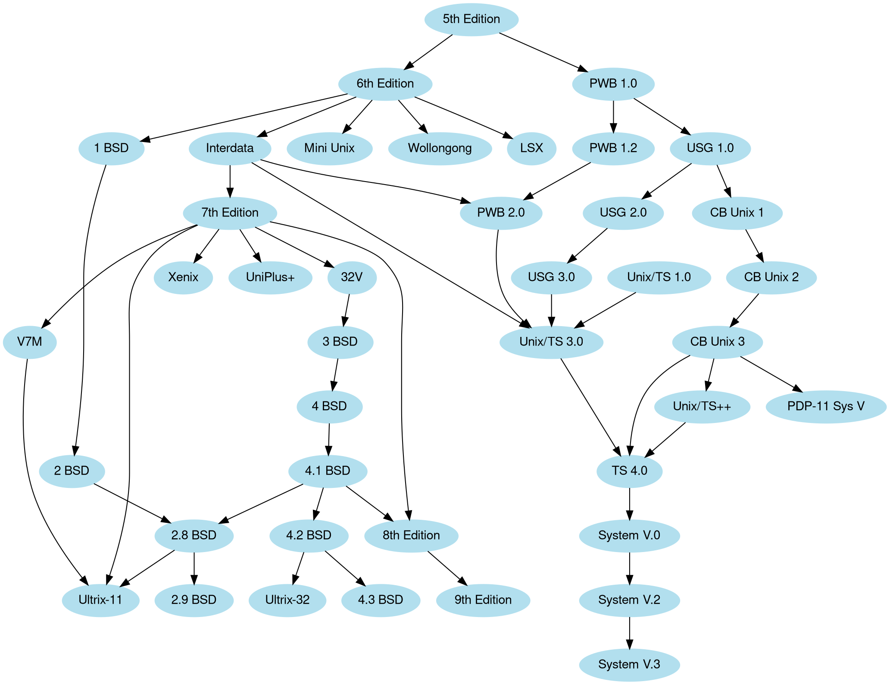

### Color Wheel

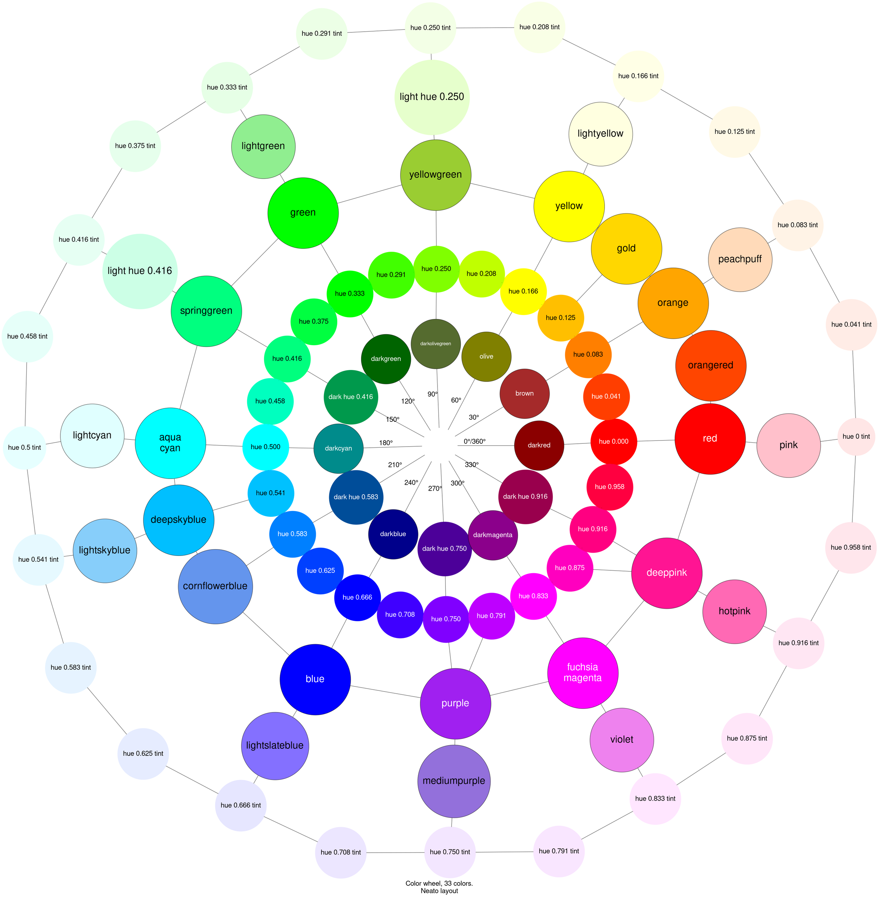

### Grid

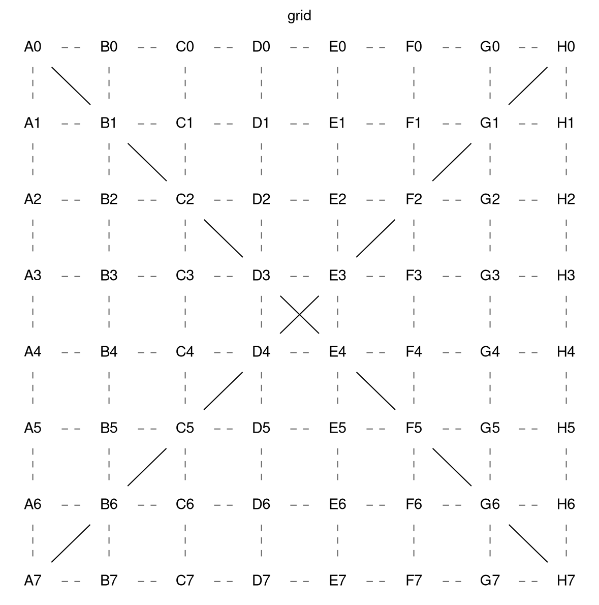

### Mindmap

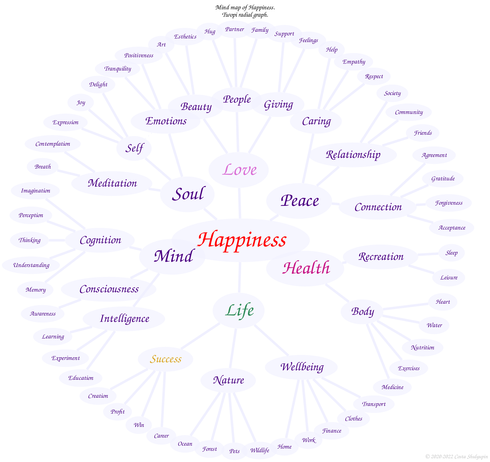

### UML Class diagram demo

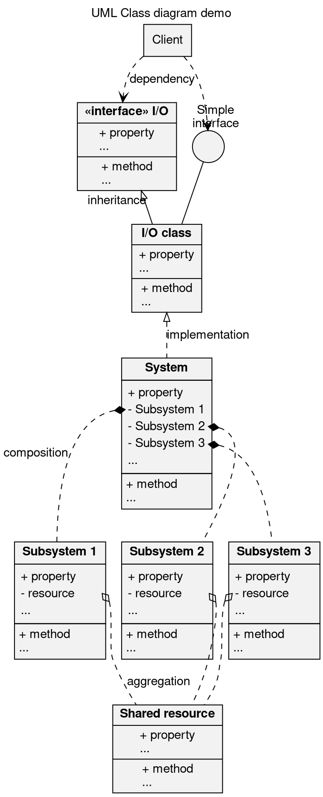

