# PlantUML Examples

## Sequence Diagram


## Use Case Diagram


## Class Diagram


## Object Diagram


## Activity Diagram


## Component Diagram


## Deployment Diagram


## State Diagram


## Timing Diagram


## JSON Diagram


## YAML Diagram
@startyaml
doe: "a deer, a female deer"
ray: "a drop of golden sun"
pi: 3.14159
xmas: true
french-hens: 3
calling-birds: 
	- huey
	- dewey
	- louie
	- fred
xmas-fifth-day: 
	calling-birds: four
	french-hens: 3
	golden-rings: 5
	partridges: 
		count: 1
		location: "a pear tree"
	turtle-doves: two
@endyaml

```

## EBNF Diagram

```plantuml
@startebnf
(* Example from §8.1 ISO-EBNF *)

h-tab = ? IS0 6429 character Horizontal Tabulation ? ;

new-line = { ? IS0 6429 character Carriage Return ? },
? IS0 6429 character Line Feed ?,
{ ? IS0 6429 character Carriage Return ? };

(* Other possible examples: *)
h-tab = ?Unicode U+0009?;
empty-special = ??;
@endebnf
```


## Regex Diagram


## Nwdiag Diagram


## SDL Diagram


## WBS Diagram


## Mindmap Diagram


## Entity Relationship Diagram


## Math Diagram
```doesntwork
@startuml
:<math>int_0^1f(x)dx</math>;
:<math>x^2+y_1+z_12^34</math>;
note right
Try also
<math>d/dxf(x)=lim_(h->0)(f(x+h)-f(x))/h</math>
<math>P(y|bb"x") or f(bb"x")+epsilon</math>
end note
@enduml

```

## C4 Diagram


